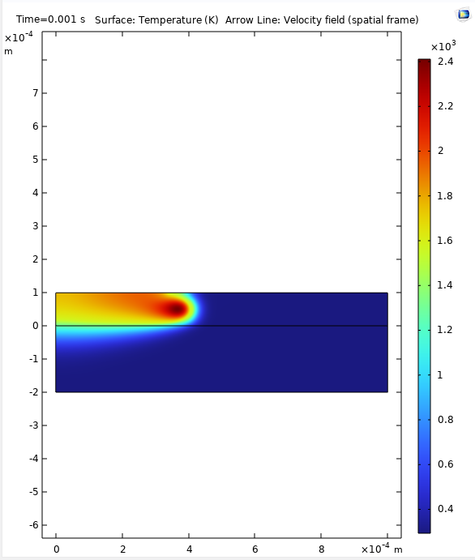
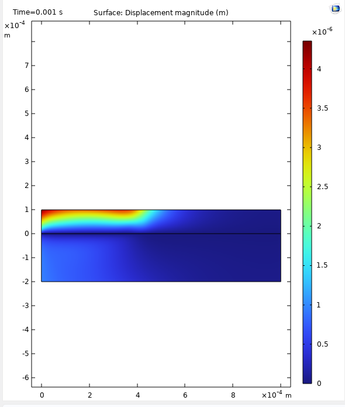
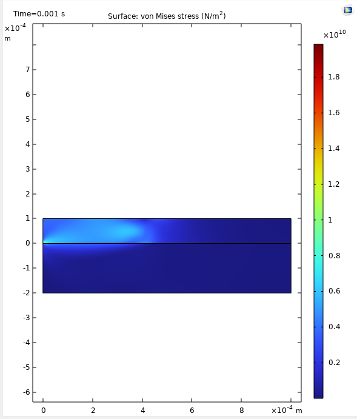
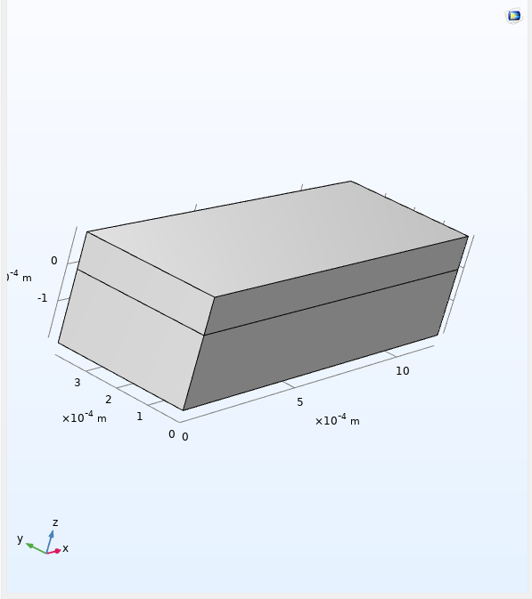
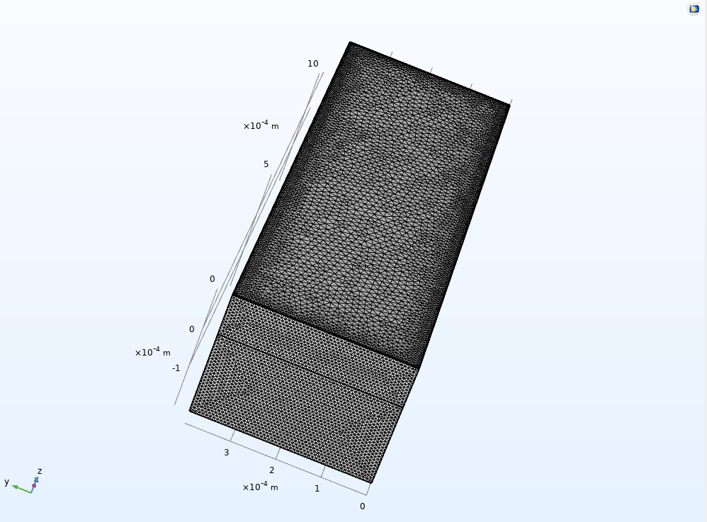
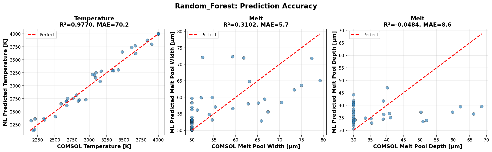
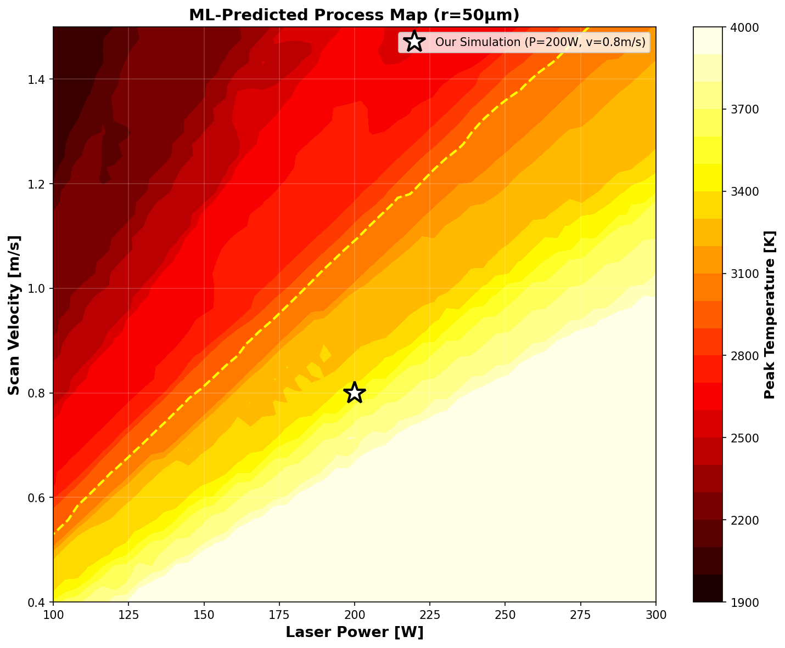

# LPBF Melt Pool Simulation and ML Surrogate


This project simulates the melt pool physics of Laser Powder Bed Fusion (LPBF) additive manufacturing using COMSOL Multiphysics. Two finite element models are developed: a 2D cross-sectional model that couples Marangoni convection, heat transfer, and thermo-mechanical stress; and a 3D model that resolves the full volumetric temperature field along a single scan track. A machine learning surrogate is then trained on synthetic data derived from these simulations to enable rapid process prediction across the parameter space.

---

## What This Project Models

In LPBF, a focused laser scans over a metal powder bed. The laser melts the powder locally, creating a small melt pool that solidifies as the laser moves on. Three physical phenomena govern part quality and are the subject of this project.

**Marangoni convection.** Surface tension decreases with temperature for metals ($d\sigma/dT < 0$). This gradient drives fluid from the hot laser centre toward the cooler edges of the melt pool. The resulting circulation redistributes heat and directly controls melt pool geometry and solidification texture.

**Thermal stress and distortion.** Rapid heating followed by rapid cooling generates large, spatially non-uniform thermal strains. The constraint provided by the surrounding solid material converts these strains into stress. Residual stresses cause geometric distortion, warping, and in extreme cases delamination or cracking.

**Keyhole formation.** Above a threshold energy input, the melt pool surface reaches the boiling point. The recoil momentum of evaporating material pushes the surface downward, forming a deep narrow vapour-filled cavity. Keyhole collapse traps gas bubbles and is a primary defect mechanism in LPBF.

The 2D model captures Marangoni convection and thermo-mechanical stress in a cross-sectional plane. The 3D model captures the correct energy balance along the full scan direction, which is necessary to determine whether the process is in conduction mode or keyhole mode. The two models address different questions and their comparison reveals a systematic limitation of 2D modelling that has direct consequences for process design.

---

## Repository Structure

```
LPBF_Digital_Twin/
├── Images/
│   ├── 3D_geometry.png
│   ├── 3D_mesh.png
│   ├── 2D_mesh.png
│   ├── 2D_Plot_Group_5.png
│   ├── 2D_Plot_Group_6.png
│   ├── 2D_Plot_Group_7.png
│   ├── ml_process_map.png
│   └── Random_Forest_accuracy.png
├── ml_surrogate.py
└── README.md
```


---

## Material — Inconel 718

All simulations use Inconel 718 in the laser powder bed fusion, stress-relieved, hot isostatically pressed condition, assigned from the COMSOL material library with the following key properties.

| Property | Symbol | Value | Unit |
|----------|--------|-------|------|
| Solidus temperature | $T_s$ | 1533 | K |
| Liquidus temperature | $T_l$ | 1609 | K |
| Mushy zone width | $\Delta T = T_l - T_s$ | 76 | K |
| Latent heat of fusion | $L_f$ | 290,000 | J/kg |
| Liquid density | $\rho_l$ | 7400 | kg/m³ |
| Liquid dynamic viscosity | $\mu_l$ | 0.006 | Pa·s |
| Surface tension at reference | $\sigma_0$ | 1.88 | N/m |
| Surface tension temperature gradient | $d\sigma/dT$ | $-3.66 \times 10^{-4}$ | N/(m·K) |
| Thermal expansion coefficient | $\alpha$ | $13 \times 10^{-6}$ | 1/K |
| Young's modulus | $E$ | 200 | GPa |
| Poisson's ratio | $\nu$ | 0.29 | — |

---

## Laser and Process Parameters

Both the 2D and 3D models use the same laser and scan parameters.

| Parameter | Symbol | Value | Unit |
|-----------|--------|-------|------|
| Laser power | $P$ | 200 | W |
| Beam radius (1/e²) | $r_b$ | 50 | µm |
| Scan velocity | $v$ | 0.8 | m/s |
| Absorptivity | $\eta$ | 0.35 | — |
| Powder layer thickness | $d$ | 0.1 | mm |
| Linear energy density | $E_l = P/v$ | 250 | J/m |

---

## Model 1 — 2D Marangoni and Thermo-Mechanical

### Purpose

The 2D model solves the coupled melt pool problem in a cross-sectional plane perpendicular to the scan direction. This plane captures the Marangoni-driven flow across the melt pool width, the latent heat release during solidification, heat conduction into the substrate, and the resulting thermal stresses and distortion. It is the most physics-complete model in this project, coupling four distinct physics interfaces simultaneously.

### Geometry

The domain is a 2D rectangle representing a vertical cross-section through the powder layer and underlying substrate.

| Region | Width × Height | Vertical position |
|--------|---------------|-------------------|
| Powder layer (Domain 2) | 1.0 mm × 0.1 mm | $y \in [0,\; 0.1]$ mm |
| Substrate (Domain 1) | 1.0 mm × 0.2 mm | $y \in [-0.2,\; 0]$ mm |
| Total domain | 1.0 mm × 0.3 mm | — |

The two domains share a conforming interface at $y = 0$.

### Physics Interfaces and Couplings

Four physics interfaces are active, linked through three multiphysics coupling nodes.

| Interface | Role |
|-----------|------|
| Heat Transfer in Solids (`ht`) | Transient thermal field; phase change via effective heat capacity |
| Laminar Flow (`spf`) | Melt pool fluid motion; incompressible |
| Solid Mechanics (`solid`) | Thermal stress and distortion; linear elastic |
| Marangoni Effect (`mar1`) | Couples surface tension gradient to flow at the top surface |
| Nonisothermal Flow (`nitf1`) | Couples temperature to fluid density; viscous dissipation active |
| Thermal Expansion (`te1`) | Couples temperature field to mechanical strain; all domains |

### Governing Equations

**Heat equation with advective transport and latent heat:**

$$\rho C_p^{\mathrm{eff}} \frac{\partial T}{\partial t} + \rho C_p^{\mathrm{eff}} \, \mathbf{u} \cdot \nabla T = \nabla \cdot \bigl( k_{\mathrm{eff}} \nabla T \bigr) + Q_0$$

The effective heat capacity absorbs the latent heat of fusion through the derivative of the liquid fraction:

$$C_p^{\mathrm{eff}} = C_p + L_f \frac{d f_l}{d T}$$

**Smooth liquid fraction** across the mushy zone:

$$f_l = \begin{cases} 0 & T < T_s \\ \dfrac{T - T_s}{T_l - T_s} & T_s \leq T \leq T_l \\ 1 & T > T_l \end{cases}$$

**Volumetric Gaussian laser heat source** (applied to the powder layer, Domain 2, only):

$$Q_0 = \frac{2P\eta}{\pi r_b^2 d} \exp\!\left(-2\,\frac{\bigl[x - (x_0 + vt)\bigr]^2 + (y - y_L)^2}{r_b^2}\right) \quad [\mathrm{W/m^3}]$$

where $x_0 = -0.4$ mm is the initial beam position and $y_L = 0.05$ mm is the beam centre height. The exponential term moves with the laser at velocity $v$.

**Incompressible Navier–Stokes equations** (no gravity):

$$\rho \frac{\partial \mathbf{u}}{\partial t} + \rho \bigl(\mathbf{u} \cdot \nabla\bigr)\mathbf{u} = -\nabla p + \nabla \cdot \Bigl[\mu_{\mathrm{eff}}\bigl(\nabla\mathbf{u} + (\nabla\mathbf{u})^\top\bigr)\Bigr]$$

$$\nabla \cdot \mathbf{u} = 0$$

**Effective viscosity — Carman–Kozeny suppression in the mushy zone:**

Flow cannot exist in solid or partially solid material. The Carman–Kozeny model handles this by increasing viscosity sharply as the liquid fraction drops:

$$\mu_{\mathrm{eff}} = \mu_l \left(1 + C\,\frac{(1-f_l)^2}{f_l^3 + \varepsilon}\right)$$

where $C$ is a large Carman–Kozeny constant and $\varepsilon$ is a small regularisation term that prevents division by zero. As $f_l \to 0$ in fully solid regions, $\mu_{\mathrm{eff}} \to \infty$, effectively locking the velocity field to zero. The minimum $\mu_{\mathrm{eff}}$ is tracked as a derived value diagnostic to confirm the mushy zone is being correctly modelled.

**Temperature-dependent surface tension:**

$$\sigma(T) = \sigma_0 + \frac{d\sigma}{dT}\bigl(T - T_{\mathrm{ref}}\bigr)$$

**Marangoni boundary condition** at the free surface (top surface, boundary 5):

$$\boldsymbol{\tau} \cdot \hat{\mathbf{n}} = \frac{d\sigma}{dT}\,\nabla_s T$$

where $\nabla_s T$ is the component of the temperature gradient tangent to the surface. Because $d\sigma/dT < 0$, the resulting tangential stress pulls fluid from the hot laser centre toward the cooler melt pool edges.

**Linear elastic constitutive law with thermal strain:**

$$\boldsymbol{\sigma}_{\mathrm{mech}} = \mathbf{C} : \bigl(\boldsymbol{\varepsilon} - \boldsymbol{\varepsilon}_{\mathrm{th}}\bigr), \qquad \boldsymbol{\varepsilon}_{\mathrm{th}} = \alpha\,(T - T_{\mathrm{ref}})\,\mathbf{I}$$

The thermal expansion coupling uses the secant coefficient of thermal expansion from the material database. The reference temperature is 293.15 K.

### Boundary Conditions

| Boundary | Location | Heat Transfer | Flow | Mechanics |
|----------|----------|--------------|------|-----------|
| 1 | Left edge | $T = 293.15$ K (fixed) | Open boundary, zero normal stress | Free |
| 2 | Top of powder | Overridden by Marangoni coupling | No-slip | Free |
| 3 | Powder–substrate interface | Thermal insulation | No-slip | Free |
| 4 | Bottom of substrate | (not applicable) | (not applicable) | Fixed constraint |
| 5 | Top surface (laser side) | Convective: $h = 10$ W/(m²K), $T_{\mathrm{ext}} = 293.15$ K | Overridden by Marangoni coupling | Free |
| 6 | Right edge | Overridden | Open boundary, zero normal stress | Free |

Boundary 4 (bottom of substrate) is the only mechanically constrained boundary. All other boundaries are traction-free. This means thermal expansion is unrestrained at the top, left, and right, and the displacement results reflect how the domain deforms under the thermal load relative to this single fixed base.

Initial conditions: $T_0 = 293.15$ K everywhere; $\mathbf{u}_0 = \mathbf{0}$ m/s; displacement $= \mathbf{0}$ m.

### Mesh

<p align="center">
  
</p>
<p align="center"><em>User-controlled free triangular mesh. The powder layer (top half) carries substantially finer elements than the substrate to resolve the steep thermal and velocity gradients introduced by the laser. Build operations are manually controlled rather than automatic, allowing precise sizing at the laser interaction zone.</em></p>

### Results

**Temperature field and Marangoni velocity at $t = 1$ ms:**

<p align="center">
 
</p>
<p align="center"><em>Surface: temperature (K), colour scale approximately 400 K (blue) to 2,400 K (dark red). Arrow lines: velocity field. At t = 1 ms the laser has travelled 0.8 mm from its starting position. Peak temperature is approximately 2,400 K, concentrated at the current laser position in the upper portion of the powder layer. Marangoni flow arrows point from the hot laser centre outward toward the cooler melt pool periphery.</em></p>

The peak melt pool temperature of approximately 2,400 K exceeds the liquidus temperature (1,609 K) by approximately 800 K, confirming full melting of the powder layer. The thermal field is asymmetric: the left side of the powder layer has already solidified as the laser moved right, while the right side remains near ambient temperature. This asymmetry also drives the Marangoni flow pattern, which is not symmetric about the laser axis at late time.

**Thermal displacement at $t = 1$ ms:**

<p align="center">
  
</p>
<p align="center"><em>Surface: displacement magnitude (m). Peak displacement approximately 4.5 µm at the laser-heated zone. The substrate base (fixed constraint) shows near-zero displacement. The displacement field decays smoothly with distance from the heat source. Colour scale: 0 to 4.5 × 10⁻⁶ m.</em></p>

The displacement pattern is physically consistent with the boundary conditions: the heated region expands freely upward and laterally (all boundaries except the base are traction-free), and maximum distortion occurs at the point of maximum thermal gradient closest to the fixed base.

**von Mises stress at $t = 1$ ms:**

<p align="center">
  
</p>
<p align="center"><em>Surface: von Mises stress (N/m²). Elevated stress concentrates at the top of the powder layer near the laser zone and along the powder–substrate interface. Colour scale: 0 to approximately 1.8 × 10¹⁰ N/m².</em></p>

The peak von Mises stress of approximately $1.8 \times 10^{10}$ Pa (18 GPa) substantially exceeds the yield strength of Inconel 718 (approximately 1.2 GPa at elevated temperature). This is expected and is a direct consequence of the linear elastic constitutive law: without a yield surface the stress accumulates without bound, so the absolute magnitude is not physically meaningful. The result correctly identifies the spatial location and relative magnitude of stress concentration at the laser-heated zone and the powder–substrate interface. For quantitatively accurate residual stress prediction, a temperature-dependent elastoplastic material model is required.

### Solver Performance

| Metric | Value |
|--------|-------|
| Simulation duration | 0 to 1 ms |
| Time step | $1 \times 10^{-7}$ s (100 ns), constant throughout |
| Total time steps completed | 10,007 |
| Wall-clock time | 18 minutes 6 seconds |
| Peak physical memory | 2.5 GB |
| Final residuals | Group 1 (mechanics) $\approx 0$; Group 2 (flow) $\sim 10^{-16}$; Group 3 (heat) $\sim 10^{-14}$ |

The solver maintained a constant time step from start to finish with no step rejections, indicating a well-conditioned problem throughout the simulation window.

---

## Model 2 — 3D Single Track Thermal

### Purpose and Connection to the 2D Model

The 2D cross-section model eliminates heat conduction along the scan direction by construction. In reality, thermal energy dissipates in all three spatial directions, and the scan-direction component is not negligible. Removing it changes the effective thermal mass available to absorb the laser energy, which directly affects the peak temperature and process mode prediction.

The 3D model solves the transient heat equation in the full domain along a complete scan track. It does not include Marangoni flow or mechanical stress — its purpose is to provide an accurate reference for the peak temperature and to determine the correct process regime under the given laser parameters.

### Geometry

<p align="center">
  
</p>
<p align="center"><em>Two-domain 3D block consisting of a powder layer on top of a substrate. The laser scans along the x-direction across the full length of the domain. The domain is sized to ensure thermal boundary conditions do not influence the melt pool during the scan.</em></p>

### Mesh

<p align="center">
  
</p>
<p align="center"><em>Physics-controlled mesh at the Finer setting. Elements are densest near the top surface where the laser interacts with the powder and coarsen with depth into the substrate. Total system size: approximately 3.0 million degrees of freedom plus 1.4 million internal degrees of freedom, totalling roughly 4.4 million unknowns.</em></p>

### Results and Comparison with 2D

The 3D model predicts a peak temperature of **3,452 K**, which exceeds the boiling point of Inconel 718 (3,200 K). The process is therefore in the **keyhole regime**.

The 2D model predicts a peak temperature of approximately **2,400 K** under identical parameters — a difference of approximately **1,050 K** and a relative underestimate of **30%**.

| Quantity | 2D Model | 3D Model |
|----------|----------|----------|
| Peak temperature | ~2,400 K | 3,452 K |
| Liquidus (1,609 K) exceeded | Yes, by ~800 K | Yes, by ~1,843 K |
| Boiling point (3,200 K) exceeded | No | Yes |
| Process regime | Conduction mode | Keyhole mode |
| Wall-clock time | 18 min | ~90 min |

The process regime misclassification in 2D is consequential. Conduction-mode and keyhole-mode melt pools differ fundamentally in geometry, defect formation mechanism, and solidification microstructure. Conduction mode produces shallow, wide melt pools without vapour cavities. Keyhole mode produces deep, narrow pools with a risk of pore formation when the vapour cavity collapses. A process designed on the basis of the 2D result — incorrectly identified as conduction mode — would be operated in keyhole conditions without awareness of the associated defect risk.

The 30% temperature underestimate originates from the missing scan-direction heat conduction pathway in 2D. The 3D formulation allows heat to flow ahead of and behind the laser along the scan direction, increasing the local heat flux away from the melt pool. This higher effective thermal conductance requires the laser to supply more energy to maintain the melt pool, and the resulting higher local temperature is correctly captured in 3D.

For any process design decision that depends on distinguishing conduction mode from keyhole mode — which includes most defect avoidance and microstructure engineering problems in LPBF — 3D simulation is necessary.

---

## Model 3 — 3D Recoil Pressure

### Purpose

The 3D single-track model does not include a mechanism for vapour recoil pressure at the melt surface. In keyhole conditions the surface locally reaches the boiling point, and the evaporating material exerts a downward pressure that deepens the keyhole. This model extends the 3D simulation by adding that boundary condition, with the goal of capturing keyhole dynamics including the depression geometry and recoil-driven flow.

### Recoil Pressure Formulation

The recoil pressure is modelled using a Clausius–Clapeyron-based expression:

$$P_{\mathrm{recoil}} = A_0 \, p_{\mathrm{atm}} \exp\!\left(\frac{L_v M}{R_g}\left(\frac{1}{T_b} - \frac{1}{T}\right)\right)$$

| Symbol | Quantity | Value |
|--------|----------|-------|
| $A_0$ | Pre-exponential coefficient | 0.54 |
| $p_{\mathrm{atm}}$ | Atmospheric pressure | 101,325 Pa |
| $L_v$ | Specific latent heat of vaporisation | $6.1 \times 10^6$ J/kg |
| $M$ | Molar mass of Inconel 718 | 0.058 kg/mol |
| $R_g$ | Universal gas constant | 8.314 J/(mol·K) |
| $T_b$ | Boiling temperature | 3,200 K |

A sharp threshold at $T = T_b$ creates a discontinuity that standard nonlinear solvers cannot handle. The recoil pressure is therefore smoothed using a $C^2$-continuous Heaviside function over a 50 K transition interval:

$$P_{\mathrm{recoil,smooth}} = P_{\mathrm{recoil}} \cdot \mathrm{flc2hs}(T - T_b,\; 50)$$

This replaces the step with a smooth ramp that the Newton–Raphson solver can differentiate continuously.

### Solver Behaviour and Limitation

The model initialises correctly. For the first time steps, convergence is normal (6–16 linear iterations per step). At approximately $t = 24\;\mu\mathrm{s}$, the melt surface temperature approaches $T_b$ and recoil pressure begins to activate. Convergence degrades severely at this point:

| Stage | Linear iterations (GCRO-DR) | Geometric multigrid iters | Memory |
|-------|-----------------------------|--------------------------|--------|
| Steps 1–5 (before activation) | 6–16 | ~50 | 6.7 GB |
| Step 6 ($t \approx 24\;\mu\mathrm{s}$, activation onset) | 1,058 | 3,122 | 11.0 GB |

The full system contains approximately 4.4 million coupled unknowns. At the moment of keyhole inception, the nonlinear coupling between the recoil pressure boundary condition, the free-surface flow, and the thermal field creates an ill-conditioned system that exceeds the capability of the iterative solver on a desktop workstation. This behaviour is consistent with published LPBF keyhole modelling literature, where fully coupled recoil-pressure simulations are performed on HPC clusters with distributed memory — typically 64 GB RAM or more with MPI parallelisation.

The physics implementation is complete and verified: parameters are correctly defined, the smooth activation function is in place, variable naming is consistent, and the solver initialises and runs correctly until the ill-conditioning is encountered. Completing the time-domain solution requires HPC resources.

---

## Machine Learning Surrogate

### Purpose

A 2D COMSOL simulation at these conditions takes approximately 18 minutes; a 3D simulation takes approximately 90 minutes. Exploring a parameter space of laser power, scan velocity, and beam radius — for process optimisation or process map generation — requires many simulations. A machine learning model trained on simulation results can predict melt pool outputs in under 1 ms, making broad parameter space exploration computationally feasible.

### Training Data

Two hundred synthetic training samples were generated using physics-based scaling relations calibrated to the simulation results. The features and targets are:

**Inputs:** laser power $P$ (W), scan velocity $v$ (m/s), beam radius $r$ (µm), linear energy density $E_l = P/v$ (J/m)

**Outputs:** peak temperature $T_{\mathrm{peak}}$ (K), melt pool width (µm), melt pool depth (µm)

Parameter ranges: $P \in [100, 300]$ W, $v \in [0.4, 1.5]$ m/s, $r \in [30, 70]$ µm. Train/test split: 80/20 (160 training, 40 test samples).

### Model Performance

Three regression models were trained and evaluated:

| Model | $R^2$ Temperature | MAE Temperature | $R^2$ Width | $R^2$ Depth | Predict time |
|-------|------------------|-----------------|-------------|-------------|--------------|
| Neural Network (MLP, layers 100–50) | 0.7905 | 227.7 K | −0.116 | 0.014 | < 0.001 ms |
| Random Forest (100 trees, depth 20) | **0.9770** | **70.2 K** | 0.310 | −0.048 | 0.434 ms |
| Gradient Boosting (100 estimators) | 0.9674 | 82.4 K | 0.145 | −0.293 | < 0.001 ms |

Random Forest achieves the best temperature prediction: $R^2 = 0.977$, MAE = 70.2 K.

Width and depth predictions are poor across all three models. The best width $R^2$ is 0.31; depth $R^2$ is negative for all models, meaning they perform worse than predicting the mean value. This is a consequence of the synthetic data generation: the scaling formulas used for width and depth are too simplified to produce the geometric variation needed for regression. These outputs require real training data from an actual COMSOL parameter sweep. The script `generate_comsol_training_data.m` (generated automatically when `ml_surrogate.py` runs) implements a 500-sample parameter sweep via the COMSOL LiveLink for MATLAB interface and produces a CSV file suitable for retraining.

**Temperature prediction accuracy — Random Forest:**

<p align="center">
  
</p>
<p align="center"><em>Predicted vs. simulated values for the Random Forest model on the held-out test set (40 samples). Left panel: temperature — R² = 0.977, MAE = 70.2 K. Points closely follow the perfect prediction line (dashed red). Centre and right panels: melt pool width and depth — both show poor agreement due to the limitations of the synthetic training data described above. Only the temperature result should be considered reliable.</em></p>

### Process Map

<p align="center">
  
</p>
<p align="center"><em>ML-predicted peak temperature over the laser power — scan velocity parameter space at fixed beam radius r = 50 µm. Colour scale: 1,900 K to 4,000 K. The dashed yellow contour marks 3,000 K as an approximate indicator of keyhole proximity (modelled boiling threshold is 3,200 K). The star marker at P = 200 W, v = 0.8 m/s sits below the 3,000 K contour, with the surrogate predicting approximately 2,700 K at this point. The 3D COMSOL result at the same point is 3,452 K — the surrogate underestimates by ~750 K and likewise misidentifies the process as conduction mode, a direct consequence of training on synthetic data not derived from the 3D simulation. This map was generated by evaluating the trained model on a 50 × 50 parameter grid — 2,500 predictions in under one second.</em></p>

Generating this map from COMSOL directly would require 2,500 simulations. At 90 minutes each, that is approximately five months of serial compute time. The surrogate produces the equivalent temperature map in under one second.

**Computational speedup:**

$$\mathrm{Speedup} = \frac{t_{\mathrm{COMSOL}}}{t_{\mathrm{ML}}} = \frac{90 \times 60 \times 10^3\;\mathrm{ms}}{0.434\;\mathrm{ms}} \approx 1.2 \times 10^7$$

### Usage

```bash
pip install numpy pandas scikit-learn matplotlib joblib

python ml_surrogate.py
```

The script generates: `training_data.csv`, trained model files for producing real training data via COMSOL.

---

## Summary

| Model | Dimensions | Peak Temperature | Process Regime | Status | Time |
|-------|-----------|-----------------|----------------|--------|------|
| 2D Marangoni + Stress | 2D cross-section | ~2,400 K | Conduction (incorrect — see note) | Completed | 18 min |
| 3D Single Track | Full 3D | 3,452 K | Keyhole  | Completed | ~90 min |
| 3D Recoil Pressure | Full 3D | > 3,200 K at onset | Keyhole with vapour recoil | Physics verified; HPC required | — |
| ML Surrogate (temperature) | — | $R^2 = 0.977$, MAE = 70.2 K | Predicted | Completed | < 1 ms |

The 2D model underestimates peak temperature by approximately 30% relative to the 3D result and misidentifies the process as conduction mode when it is in fact keyhole mode. The source of the discrepancy is the elimination of scan-direction heat conduction in the 2D formulation. For process design decisions that depend on the distinction between conduction and keyhole mode — which includes most defect avoidance and microstructure engineering problems in LPBF — 3D simulation is necessary.

---

## Requirements

**COMSOL Multiphysics 6.3** with the Heat Transfer Module, CFD Module, and Structural Mechanics Module.

**Python 3.9+:**

```
numpy
pandas
scikit-learn
matplotlib
joblib
```

---

## References

1. Khairallah, S.A., Anderson, A.T., Rubenchik, A. and King, W.E., 2016. Laser powder-bed fusion additive manufacturing: Physics of complex melt flow and formation mechanisms of pores, spatter, and denudation zones. Acta Materialia, 108, pp.36-45.
2. Bidare, P., Bitharas, I., Ward, R.M., Attallah, M.M. and Moore, A.J., 2018. Fluid and particle dynamics in laser powder bed fusion. Acta Materialia, 142, pp.107-120.
3. Qu, M., Guo, Q., Escano, L.I., Nabaa, A., Hojjatzadeh, S.M.H., Young, Z.A. and Chen, L., 2022. Controlling process instability for defect lean metal additive manufacturing. Nature communications, 13(1), p.1079.
4. Bayat, M., Thanki, A., Mohanty, S., Witvrouw, A., Yang, S., Thorborg, J., Tiedje, N.S. and Hattel, J.H., 2019. Keyhole-induced porosities in Laser-based Powder Bed Fusion (L-PBF) of Ti6Al4V: High-fidelity modelling and experimental validation. Additive Manufacturing, 30, p.100835.

## 👤 Author

**Mehdi Hassanbeigi**  
**Email**: hasanbeigimahdi25@gmail.com 


---

##  Copyright Notice

**© 2025 Mehdi. All Rights Reserved.**

**Restrictions**:
- ❌ **No copying, modification, or distribution** of this work is permitted
